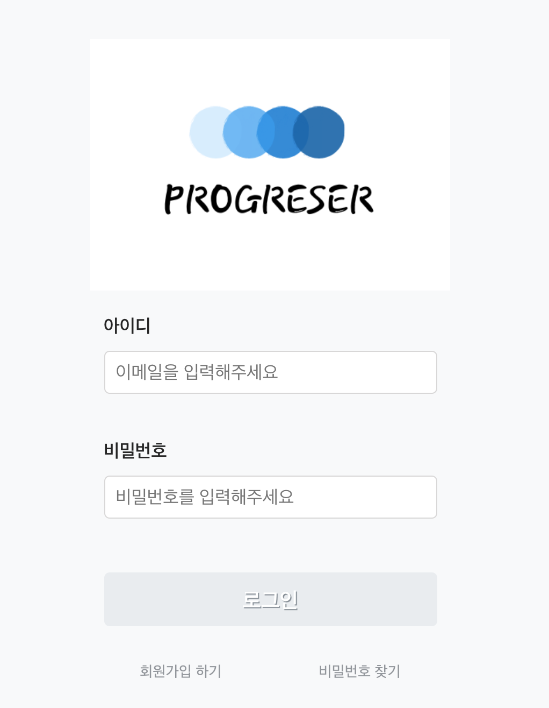
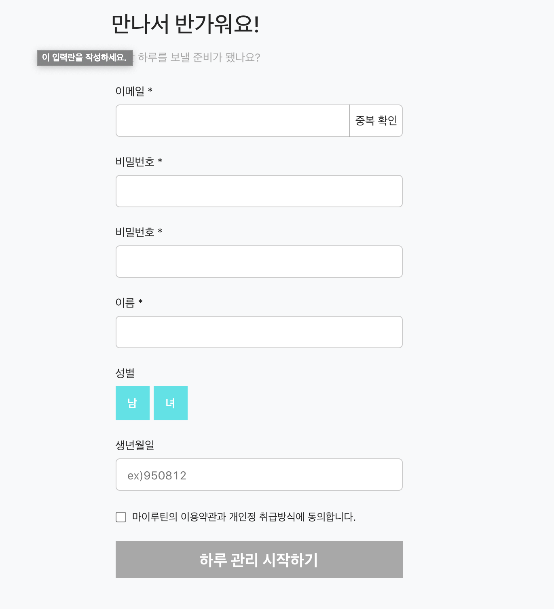
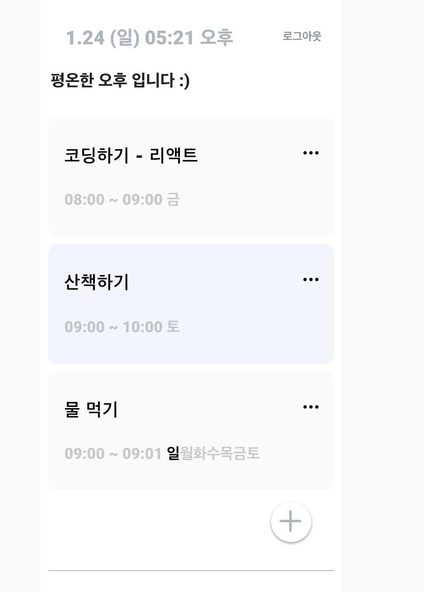
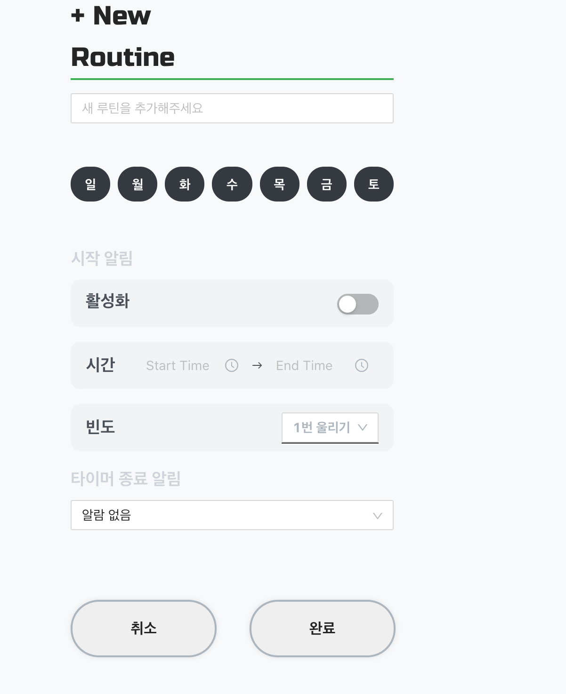

# 리엑트를 활용한 Routine APP 만들기

Routine이란 루틴은 규칙적으로 하는 일의 통상적인 순서와 방법이고 자신이 원하는 습관을 만들어 나갈 수 있도록 도와주는 루틴 앱이다.

## 사용 기술 스택


## Login PAGE



1. 리액트 Hook의 useRef를 활용
2. Form태그에서 onSubmit 이벤트 발생시 기본 액션 타입 3개 (start, success, fail) 리듀서 함수 및 사가 함수 구현

로그인을 성공 할 시 LocalStorage에 token을 넣어서 로그인 유/무 확인

## 회원가입 페이지



1. JS에서 제공하는 FormData() WebAPI 사용

   => 회원가입 항목의 하나씩 선택해서 사용하는 것은 비효율적이라 생각하고 고민하면서 찾아본 결과 FormData라는 form안에서 Submit이 발생하면 데이터를 가져오는 것이 있어서 사용하였습니다.

```js
const Submit = useCallback(
  e => {
    e.preventDefault();
    const obj = {};
    const formData = new FormData(e.target);
    for (let [key, value] of formData.entries()) {
      obj[key] = value;
    }
    onSign(obj);
  },
  [onSign],
);
```

이 밖에 이메일 유효성 검사와 비밀번호 확인 체크 이 것은 useRef를 사용을 하였습니다.

## Main Page



1. 현재 날짜를 보여주는 부분은 react-moment 라이브러리로 구현
2. '평온한 오후' 이 부분을 보여주는 영역은 새로고침시 랜덤으로 메시지를 보이게 구현 보여줄 여러 메시지를 배열에 넣고 랜덤 함수를 사용

```js
const nowTime =
  hour > 6 && hour < 12
    ? '아침'
    : hour > 12 && hour < 18
    ? '오후'
    : hour > 18 && hour < 21
    ? '저녁'
    : '밤';

const messages = [
  `평온한 ${nowTime} 입니다  :)`,
  `어떤 ${nowTime}시간을 보내고 계신가요?`,
  '나른함을 깨워줄 음악을 들어보세요!',
  '루티너와 함께 일상을 변화시켜요!',
  '좋은 변화는 좋은 습관에서 시작해요!',
  '작은 좋은 습관이 큰 변화를 만듭니다.',
];

const randomItem = messages[Math.floor(Math.random() * messages.length)];
```

3. '...' 아이콘을 누르면 수정/삭제 버튼 보여짐 수정을 누를 시 input이 보여지고 수정을 하거나 삭제를 할때 routine별 고유id를 가져와서 해당된 루틴을 수정 및 삭제 하는 액션을 디스패치 함

## ADD ROUTINE PAGE

1. Ant design의 component들을 사용하여 구현을 하였고 new Routine에서 설정하는 값들을 한번에 받아 오기 위해서 Ant의 Form component를 가져와서 구현
2. 알림음 설정은 audio 태그를 넣어 선택시 바로 샘플 사운드를 들어볼수 있게 구현



```js
const onAlarmChange = alarm => {
  setAlarm(alarm);
  audio.current.src = `./audio/${alarm}.mp3`;
  audio.current.play();
};
```

## 프로젝트 기여한 기능

1.  Redux와 saga를 이용해 액션 생성 및 비동기 로직
2.  루틴 메인 페이지 SCSS를 이용한 스타일링
3.  새로고침 시 store에 있는 데이터가 날라가는 현상 수정
4.  회원가입 이메일 체크, 비밀번호 체크 와 스타일링

## 프로젝트 후기

리엑트 프로젝트를 하면서 리엑트에 대해 잘 모르고 하였지만 리엑트로 CRUD 즉 create,read,update,delete를 구현 하면서 많이 리엑트를 배우게 되었다.
